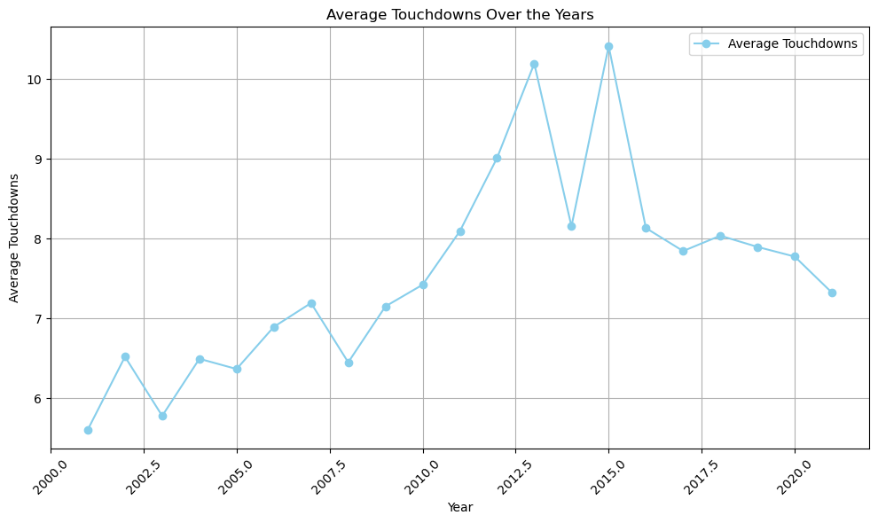

# NFL Quarterback Performance Forecaster

### **Goal** : We aim to predict the NFL Passer Rating (Rate), a comprehensive metric that evaluates a quarterback's overall performance through statistical analysis based on various passing statistics and team attributes.

---

**Datasets Used** <br>
The datasets include detailed statistics of NFL players focusing on quarterbacks ranging all the way from 2001 to 2023. These datasets (including in the repo) are :

- NFL_League_Master.csv
- passing_cleaned.csv
- Team name abbreviations.xlsx

`passing_cleaned.csv` is the dataset of main focus which has the most information but lacks some features regarding team victories. So, we have pulled another dataset `NFL_League_Master.csv` to list out total wins and losses per team. Later, we found ambiguity between the team names in these datasets, so, we created another dataset `Team name abbreviations.xlsx` which maps a team's full name to it's abbreviated name.


[temp]: https://www.kaggle.com/datasets/rishabjadhav/nfl-passing-statistics-2001-2023/data "NFL Statisitics"
**Origin and Utility** <br>
These datasets are compiled from publicly available [NFL Statisitics][temp], collected to analyze the performance metrics of quarterbacks. Understanding these metrics, which obviously took a lot our time, helps in predicting player performance, team strategies, and potentially for betting analytics.

---


**Process Overview** <br>
The project involved several stages:


***Data Cleaning*** : We're fortunate enough to retrieve a structured dataset. Handled missing values. Figured out unnecessary columns and dropped them.<br>
***Data Merging*** : Combining datasets based on team names and game results.<br>
***Exploratory Data Analysis (EDA)***: Analyze the distributions of the features and the target variable, and explore the correlations between them. Initially, we thought of making prediction and analysis based on the players later decided to move ahead with teams rather than players based on various constraints for instance, a lot of unique player names etc.<br>
***Feature Selection***: Based on correlation and importance, select the most relevant features for predicting the passer rating.<br>
***Model Training and Evaluation***: Split the data into training and testing sets, and train the model on the training set and evaluating on the testing set.

---

**Feature Description** <br>
The primary fields from the datasets include:

*Player*: Name of the Player<br>
*Tm (Team)*: Team abbreviation<br>
*Age*: Age of the player<br>
*G (Games)*: Games played<br>
*GS (Games Started)*: Games started<br>
*Cmp (Completions)*: Completed passes<br>
*Att (Attempts)*: Pass attempts<br>
*Cmp% (Completion Percentage)*: Percentage of completed passes<br>
*Yds (Yards)*: Passing yards<br>
*TD (Touchdowns)*: Touchdowns thrown<br>
*Int (Interceptions)*: Interceptions thrown<br>
*Lng (Longest Pass)*: Longest pass<br>
*Y/A (Yards per Attempt)*: Average yards per attempt<br>
*Rate (Passer Rating)*: NFL passer rating<br>
*Sk (Sacks)*: Times sacked<br>
*YdsL (Yards Lost Due to Sacks)*: Yards lost due to sacks<br>
*NY/A (Net Yards per Pass Attempt)*: Net yards per pass attempt adjusting for sacks<br>
*ANY/A (Adjusted Net Yards per Pass Attempt)*: Adjusted net yards per attempt accounting for touchdowns and interceptions<br>
*W*: Wins<br>
*L*: Losses<br>


---

**Exploratory Data Analysis (EDA)**<br>
***X Variables***: Player attributes and game statistics.<br>
***Y Variable***: Passer Rating (Rate).<br>
***Type***: Regression problem.<br>
***Observations***: Data from multiple seasons, including thousands of game entries. Derived various significant based on the correlation matrix.<br>

```
Most significant features:
PCT       245.386846
AY/A       31.147241
Y/A       -28.167863
Int%       12.898250
L           7.537771
W          -7.285590
Pct.1      -6.039159
TD%        -5.530095
Tm_MIA      4.577720
Tm_WAS      4.342206
```

***Feature Distribution***: Focused on derived significant features like touchdowns which may have high positive or negative impact on the prediction and presented their distributions as histogram plots.<br>

<br>

***Y Distribution***: Examined to understand central tendencies and outliers.<br>

> [!NOTE]  
> Outliers are presented as box plots as shown below.

<br>

***Correlation Analysis***: Key in identifying multicollinearity, influencing feature selection.<br>

<p>
    
    
</p>

***Feature engineering***
- *Encoding*: Used one-hot encoding for team names due to nominal nature.
- *Feature Interaction*: Engineered features from existing data to better capture effects like age impact by categorizing into bins.


**Model Fitting** <br>
***Train/Test Split***: Used an 80/20 split, ensuring enough data for testing while preventing overfitting.<br>
***Data Leakage Risks***: Avoided by ensuring year-based splits where necessary and carefully addressed future predictions which may get affected by data leakage.<br>
***Model Selection***: Linear Regression.


**Validation / Metrics**<br>
***Primary Metric***: R² to measure the proportion of variance in the passer rating explained by the predictors.<br>
***Model Limitations***: Linear models struggled with non-linear relationships, highlighted by residual plots and higher R² values.


**Production**<br>
***Deployment***: Model could be deployed in a real-time sports analytics system, offering updates post-game.<br>
***Precautions***: Ensure continuous data updates and recalibration to account for changes in team dynamics and rules.


**Going Further**<br>
***Potential Improvements***: Incorporating more granular data like weather conditions, player injuries, and more advanced statistical techniques like ensemble methods could enhance the model.

---

**Analysis Overview**<br>
Some of the analyzed categories are shown below, please find more in the profect.

***Identifying Outliers***: Box plots are generated for various features in the dataset to visually identify outliers. Each box plot displays the distribution of values within a feature, highlighting the median, quartiles, and potential outliers.

```
for feature in sample_features:
    plt.figure(figsize=(10, 4))
    sns.boxplot(x=X_train[feature])
    plt.title(f'Box plot of {feature}')
    plt.xlabel(feature)
    plt.show()
```

***Average Touchdowns over the Years***: This line chart tracks the average touchdowns by year. It provides insights into trends over time, showing how these statistics have evolved, which could indicate changes in playing strategies or rules.


```
avg_touchdowns_per_year.plot(kind='line', marker='o', color='skyblue', label='Average Touchdowns') 
plt.title('Average Touchdowns Over the Years')
plt.xlabel('Year')
plt.ylabel('Average Touchdowns')
plt.xticks(rotation=45)
plt.grid(True)
plt.legend()
plt.tight_layout()
plt.show()
```



***Average Passing Yards per Quarterback Age Group***: This visualization categorizes quarterbacks by age group and compares their average passing yards. It provides an analysis of performance trends across different age groups, potentially reflecting peak performance periods and the impact of experience or physical decline.

```
avg_yrds_per_age_group.plot(kind='bar', color='lightseagreen')
plt.title('Average Passing Yards per Quarterback Age Group')
plt.xlabel('Age Group')
plt.ylabel('Average Passing Yards')
plt.xticks(rotation=45, ha='right')
plt.tight_layout()
plt.show()
```

